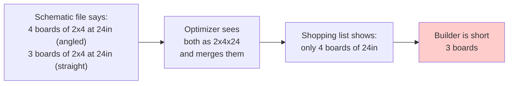
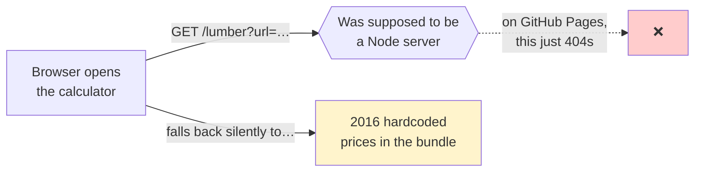

# Notes from a 2026 Review

I built this calculator in 2017 (originally in C, in 2016) to reduce wood waste
on school-beautification projects — picnic tables, benches, planter boxes, and
the like. I haven't touched the code in years. In 2026 I asked an LLM to read
through it and tell me what it could spot.

**The code in this repo is intentionally unchanged.** This file is the
write-up. It documents what I built then, not what I'd build now.

---

## At a glance

| # | Finding | How bad |
|---|---------|---------|
| 1 | Two schematics produce a shopping list that's short on boards | 🔴 wrong answers, shipping today |
| 2 | The page loads a helper script from a domain that was taken over by attackers in 2024 | 🔴 anyone visiting the live site is loading attacker code |
| 3 | Lumber prices haven't actually refreshed since 2016 | 🟡 costs shown are roughly half of reality |
| 4 | The optimizer never mixes cut lengths on the same board, so it leaves wood on the table | 🟡 saves less than it could |
| 5 | Smaller cosmetic and accuracy issues (saw-blade waste, broken images, dead code) | ⚪ minor |

---

## 1. Two schematics are missing boards

> **What it means in one sentence:** if you hit "Calculate" for these two
> schematics today, the parts list you get is short.

When two cuts in a schematic happen to be the same size — even if one is
straight and the other is angled — the math treats them as one and only keeps
the cheaper of the two. The other set of boards silently disappears from the
shopping list.



I had the LLM run the real algorithm against every schematic in the file.
Two trigger this:

```
Single Planter Bench          → 3 boards short (2x4 at 24in)
Toddler Picnic Table          → 1 board short (2x4 at 29.5in)
```

Everything else checked out.

**Why it happens:** the optimizer labels each cut by its dimensions only —
`thick × wide × long`. It ignores whether the cut is angled. So two cuts that
look identical on a tape measure end up sharing a label, and a later step
keeps only one of them.

**Where to look if you're curious:** the cut label is built in
`public/js/controllers/_optimize.js` around line 56. The collapsing step is
just below it, lines 21–34.

---

## 2. The page is loading a script from a hijacked source

This is the one I'd act on first if the site were live to real users.

In the production page (`public/views/partials/scripts.ejs`), there's a tag
that loads a helper script from a service called `cdn.polyfill.io`. In 2017
this was a well-known free service, used by hundreds of thousands of websites.

**In February 2024 the domain was sold to a different company and immediately
began serving malicious code to every site still pointing at it.** It got
flagged by Google Safe Browsing, Cloudflare started auto-rewriting it, and the
ecosystem moved on. But this repo's deployed page still has the original
script tag.


I confirmed it's still in the built output by running the production build
locally and grepping the resulting `index.html`. The line is in there.

**Practical impact:** anyone who has loaded the live page since February 2024
has been running whatever code that domain decided to serve them. For a
hobbyist tool with low traffic the realistic blast radius is small, but the
exposure is real.

---

## 3. Lumber prices haven't refreshed since 2016

The app was originally designed to fetch live prices from Home Depot. There's
a small backend server (`server.js`, `scraper.js`) that does the scraping.
At some point the project moved to GitHub Pages, which only serves static
files — there's no backend running there.



I confirmed by building the project locally, serving it as a static site, and
hitting that endpoint. It returns 404. The JavaScript that calls it never sees
a response, so it never updates anything, so the calculator just uses the
prices it was shipped with.

For reference, the cached prices are:

```
2x4x8'  → $3.27   (2016)
2x6x8'  → $6.57   (2016)
4x4x8'  → $6.97   (2016)
```

In 2026 the actual prices are roughly twice that. The calculator still
"works" — it just shows an unrealistically low total.

---

## 4. The optimizer leaves wood on the table

> **What it means in one sentence:** today the calculator picks the best
> board size for each cut length separately. It never mixes different cut
> lengths on the same board, which is exactly what a person with a saw would
> do.

Here's the idea. Suppose you need a 60-inch piece and two 17-inch pieces, and
the board you can buy is 96 inches (8 feet) long.

What the calculator does today, for each cut length independently:

```
For the 60in piece:        ┌───── 60in ─────┐                              
                           │ used           │     36in of scrap            
                           └────────────────┴──────────────────────────────┘

For the 17in pieces:       ┌─17─┬─17─┬─17─┬─17─┬─17─┬─11in scrap─┐
                           │    │    │    │    │    │            │
                           └────┴────┴────┴────┴────┴────────────┘
```

What a person with a saw would do:

```
                           ┌───── 60in ─────┬─17─┬─17─┐ ← only 2in scrap
                           │                │    │    │   on the same board
                           └────────────────┴────┴────┘
```

I had the LLM run a simple version of this smarter approach against the
"Backed Bench" schematic. The numbers:

| Approach | Boards | Cost | Scrap |
|---|---|---|---|
| Current | 7 | $57.19 | 94 inches |
| Smarter (mixing cuts on same board) | 7 | $55.79 | **70 inches** |

So on one bench: about $1.40 cheaper, and **25% less wasted wood**. Modest on
one bench but it grows with quantity, and it grows a lot on schematics with
more cut sizes (planter benches, picnic tables).

There's a well-studied name for this kind of problem (the "cutting stock"
problem) and small versions like this one can be solved exactly in
milliseconds today using freely available solvers. In 2017 this wasn't
something I was going to write on a Tuesday afternoon. In 2026 it's a
weekend.

---

## 5. Small stuff worth noting

These are real but minor.

- **Saw-blade waste isn't accounted for.** Every cut removes roughly 1/8 inch
  of wood (the thickness of the saw blade itself). Over seven cuts on one
  board that's nearly a full inch, which is sometimes enough to make a cut
  not fit. The math treats the saw as infinitely thin.

- **Some preview images are dead.** The schematic preview images point at
  `i.imgur.com` over plain `http://`. On a modern site served over `https://`
  the browser will refuse to load them. A few of those images may also have
  been auto-deleted from Imgur by now.

- **A leftover server address.** A line in `routes/index.js` sends a specific
  IP address (`107.170.51.204`) back to the browser. Probably debug code that
  was meant to be removed.

- **Hangs forever on price fetch failure.** Related to finding #3, the price
  fetch only handles the success case. When it fails (which is always now),
  the promise it's waiting on is never resolved or rejected — it just sits
  there. Doesn't actually break anything visible because the rest of the page
  doesn't wait for it, but it's a latent oddity.

- **No automated tests.** The math is the whole point of the app, and there's
  nothing checking it. Finding #1 (the missing boards) would have been caught
  the first time someone added a basic "count the cuts in the output" test.

---

## How I checked

So you can reproduce or trust what's above:

- **Finding #1** — I extracted the schematics file and ran the real
  optimizer code (copy-pasted into a standalone Node script, no UI) against
  every schematic for quantity = 1. I summed the required cuts from the
  schematic and compared to the cuts in the output. Two schematics had
  shortfalls.
- **Finding #2** — Ran `npm run prod` and inspected the resulting
  `dist/index.html`. The script tag is in the built artifact, not just the
  source.
- **Finding #3** — Built the production output and served it as a static
  site locally. Pointed a browser-equivalent request at `/lumber?...` and
  got an HTTP 404 from the static server, confirming there's no endpoint to
  serve real prices.
- **Finding #4** — Ran a small "First-Fit Decreasing" packing heuristic on
  the same cut list and compared its board count and scrap to the current
  algorithm's output for the Backed Bench schematic.

---

## A note on why nothing here is fixed

This was one of the first real things I built. I want the repo to keep
showing what I could and couldn't see in 2017, not be quietly rewritten as
my abilities grew. The point of this file is to put a marker next to the
code that says "here's what a careful pair of eyes (with eight more years of
hindsight) found." If I ever come back to actually fix any of it, that'll
happen in a separate branch with its own commits.
